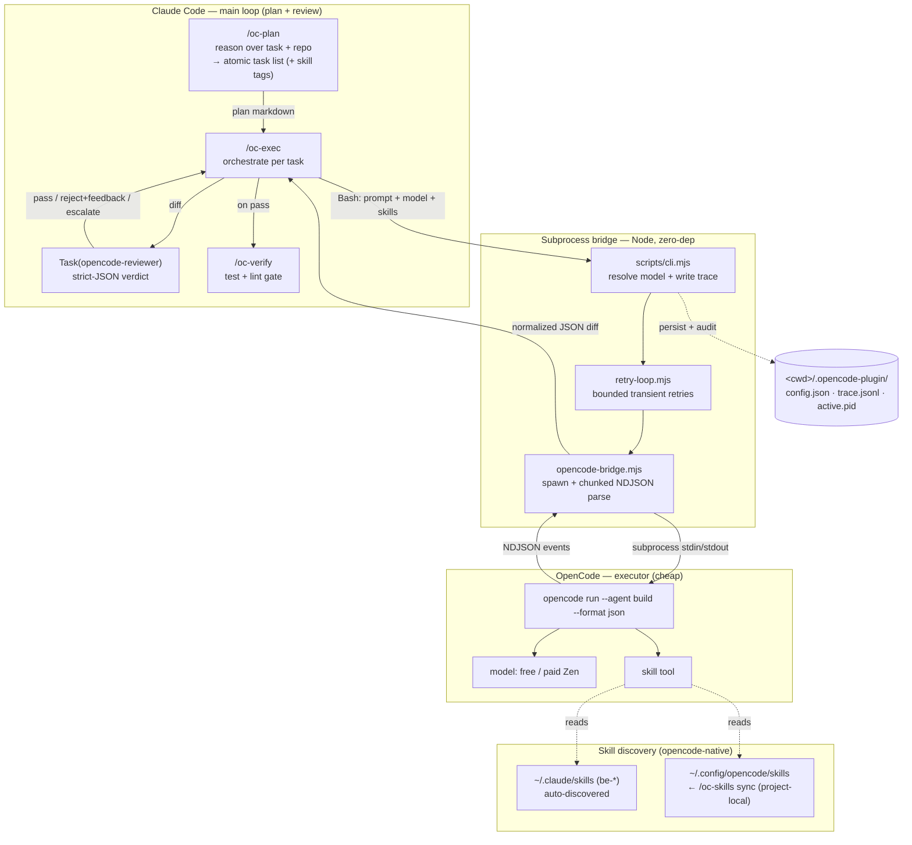
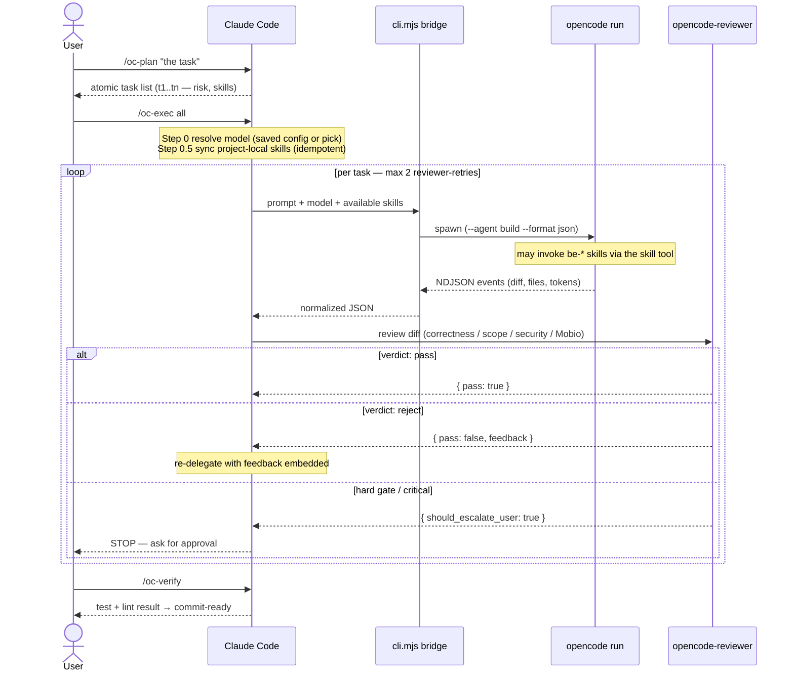

# opencode-plugin-cc

Claude Code plugin to orchestrate [anomalyco/opencode](https://github.com/anomalyco/opencode) — let Claude Code plan + review, OpenCode execute tasks with a free **or cheap paid (OpenCode Zen)** model.

Inspired by [openai/codex-plugin-cc](https://github.com/openai/codex-plugin-cc) (Claude Code ↔ Codex), this plugin wires CC ↔ OpenCode so Claude takes the architect / reviewer role (high quality) while OpenCode does the implementation grunt-work. Pick the executor model with `/oc-model`: a free model, or a paid **OpenCode Zen** model (`opencode-go/*`) — Zen pricing is low enough that **Claude Pro (plan) + OpenCode Zen (execute)** still costs far less than having Claude write all the code itself.

> **Status:** v0.5.0. End-to-end verified against `opencode` 1.15.x (NDJSON output parsing). Zero runtime npm deps. Onboarding order is **install → pick model → plan → exec → verify**. On first run you pick the executor model via `/oc-model` — free **or** paid OpenCode Zen (saved per project; auto-pick stays free-only). OpenCode can use your Claude Code skills (`~/.claude/skills` discovered natively; project-local skills bridged via `/oc-skills`). Commands are namespaced (`/opencode-plugin-cc:oc-*`). `/oc-install` bootstraps opencode if missing. Still early — validate on your own tasks before relying on it.

## Why

Two phases — **setup once**, then the repeatable loop:

1. **Setup:** `/oc-install` (get opencode) → `/oc-model` (pick the executor model).
2. **Loop:** `/oc-plan` → `/oc-exec` → `/oc-verify`.

- **Plan:** Claude Code reads task + repo context, breaks into atomic sub-tasks with risk tags (and optionally tags which Claude Code skills the executor should use).
- **Exec:** Each sub-task forwarded to OpenCode CLI via a subprocess bridge. OpenCode runs the chosen model (free or paid Zen), can invoke your Claude Code skills, and returns a structured diff.
- **Verify:** A Claude Code reviewer subagent inspects the diff (correctness / scope / security / Mobio rules), then a test/lint gate runs. If reviewer rejects, CC re-delegates with feedback — bounded retry.

Net effect: pay Claude tokens only for planning + review, save Claude tokens on grunt edits.

## Requirements

- [Claude Code](https://www.anthropic.com/claude-code) CLI
- Node.js ≥ 20
- [anomalyco/opencode](https://github.com/anomalyco/opencode) ≥ v1.2 in `PATH` — **don't have it? run `/opencode-plugin-cc:oc-install`** (detects brew / curl | bash / npm / scoop / choco for your OS and asks before running)
- A configured model provider in OpenCode — a free model, or paid OpenCode Zen (see [opencode.ai/docs/cli](https://opencode.ai/docs/cli/))

## Install

### Option A — marketplace (recommended)

Run these inside Claude Code:

```
/plugin marketplace add luongndcoder/opencode-plugin-cc
/plugin install opencode-plugin-cc@luongndcoder
```

Then reload Claude Code. Verify the commands loaded: type `/oc` and press **Tab** → you should see `opencode-plugin-cc:oc-*`.

> The plugin has **zero runtime npm dependencies** — nothing to `npm install`, it works straight from the clone.
> Don't have `opencode` yet? Run `/opencode-plugin-cc:oc-install` and it'll set it up.

### Option B — local / dev (load a directory)

```bash
git clone https://github.com/luongndcoder/opencode-plugin-cc.git
cd opencode-plugin-cc
claude --plugin-dir "$(pwd)"     # launch Claude Code with this dir as a plugin
```

Quick verify:

```bash
opencode --version           # should report >= 1.2.0  (or run /opencode-plugin-cc:oc-install)
node scripts/cli.mjs --help  # CLI usage
npm test                     # 75/75 unit tests (Node's built-in runner, no deps)
```

## Commands

> **Invoke with the plugin namespace.** Claude Code registers these as namespaced commands — type `/opencode-plugin-cc:oc-exec` (tip: type `/oc` then press **Tab**). The bare `/oc-exec` is **not** a valid slash command and returns "Unknown command". The names below are shown unprefixed for brevity.

Run them in this order — setup first, then the loop:

| #   | Command       | Purpose                                                                       |
| --- | ------------- | ----------------------------------------------------------------------------- |
| 1   | `/oc-install` | Detect & install (or upgrade) `opencode` for your OS — asks before running    |
| 2   | `/oc-model`   | List opencode models (free + paid Zen, with cost) and pick one (saved per project) |
| 3   | `/oc-skills`  | (optional) Bridge your Claude Code skills into OpenCode — list / sync / clean  |
| 4   | `/oc-plan`    | Claude Code drafts an atomic task list from your prompt + repo context        |
| 5   | `/oc-exec`    | Delegate one or all planned tasks to OpenCode, with reviewer + retry gate     |
| 6   | `/oc-verify`  | Run repo's test + lint after `/oc-exec`; re-delegate on failure if you choose |
| —   | `/oc-cancel`  | Cancel the currently-running `/oc-exec` via PID file in cwd                   |
| —   | `/oc-status`  | (v2 placeholder) Background job polling                                       |
| —   | `/oc-result`  | (v2 placeholder) Fetch background job result                                  |

Typical session (first time in a repo) — setup, then loop:

```
# ── setup (once) ───────────────────────────────────────────
/opencode-plugin-cc:oc-install
→ checks opencode; if missing, asks consent then installs for your OS

/opencode-plugin-cc:oc-model
→ lists free + paid Zen models with cost → you pick one → saved to
  <cwd>/.opencode-plugin/config.json

# ── loop (repeat per task) ─────────────────────────────────
/opencode-plugin-cc:oc-plan add hello function with unit test in src/lib/
→ CC outputs t1: add hello fn, t2: add unit test (each may tag relevant skills)

/opencode-plugin-cc:oc-exec all
→ CC bridges project-local skills (if any) → builds prompt → invokes
  scripts/cli.mjs subprocess
→ OpenCode executes t1 with your chosen model (may invoke be-* skills), returns diff
→ Reviewer subagent verifies diff (passes) → same for t2 → summary printed

/opencode-plugin-cc:oc-verify
→ Detects `npm test` from package.json → runs → green → commit-ready
```

> First `/opencode-plugin-cc:oc-exec` with **no saved model** runs the `/oc-model`
> picker inline before executing, so you can skip step 2 and let exec prompt you.

## Configuration

- **OpenCode model selection:** model quality varies, so **on the first `/oc-exec` the plugin lists the available models — free and paid OpenCode Zen (`opencode-go/*`) with per-1M-token cost — and asks you to pick one** (run `/opencode-plugin-cc:oc-model` any time to choose / change; picking a paid model shows its cost first). Your choice is saved per project in `<cwd>/.opencode-plugin/config.json` (`{"model": "..."}`) and reused on every later run — no repeat prompt. Resolution precedence: explicit `--model <provider>/<name>` (also persisted) → saved config → **auto-pick is free-only** (`cost.input` and `cost.output` both `0`) so the plugin never spends money without an explicit choice. The model actually used is logged to stderr + a `model_selected` trace event (with `source`: flag/config/auto).
- **Trace log:** every `/oc-exec` appends to `<cwd>/.opencode-plugin/trace.jsonl` with `traceId`, attempt, status, duration, model, exit code, error. Use this to audit cost and reliability.
- **Retry budget:** default 2 retries inside the bridge (transient errors) + up to 2 reviewer-driven retries at CC level. Adjust via `--max-retry` to CLI.

## Using your Claude Code skills in OpenCode

OpenCode (≥ 1.15) **natively discovers skills** from three global roots: `~/.claude/skills`, `~/.agents/skills`, `~/.config/opencode/skills`. So your **global** Claude Code skills — including the Mobio `be-*` set in `~/.claude/skills` — are already available to the OpenCode executor with no setup. During `/oc-exec`, the build agent can invoke them via its skill tool.

Two layers wire this into the workflow:

- **Inject (which skill to use):** `/oc-plan` can tag each sub-task with the relevant skill(s); `/oc-exec` passes them into the OpenCode prompt (`Skills khả dụng: …`) so the executor knows to invoke them. Claude picks **instruction-only** skills per task (e.g. `be-logging-convention`, `be-databases`) and avoids skills that need Claude-Code-only tools (`AskUserQuestion`, Task subagents, the Skill tool, `/opencode-plugin-cc:*` commands) — those can't run in OpenCode's headless mode.
- **Sync (project-local skills):** OpenCode does **not** discover project-local `<cwd>/.claude/skills/`. `/oc-skills sync` (also auto-run by `/oc-exec`) symlinks them into `~/.config/opencode/skills/` so OpenCode sees them, recording a manifest. It never clobbers a name that already exists globally (reported as a collision and skipped). Remove the bridge with `/oc-skills clean` when you're done — `clean` only removes symlinks the plugin created.

Use `/opencode-plugin-cc:oc-skills list` to see exactly what OpenCode discovers and which project-local skills are unbridged.

> Synced project skills live in OpenCode's **global** skill dir until you `clean` them — they're harmless symlinks, but run `/oc-skills clean` to keep that dir tidy across projects.

## Privacy warning

Source code in your repo is sent verbatim to OpenCode's chosen model provider (Ollama is local; OpenCode Zen / Groq / OpenRouter / DeepSeek are remote cloud). This applies to **both free and paid Zen** models. If you handle PII, secrets, or proprietary IP, **opt-in per project** and prefer local providers (Ollama / llama.cpp / LM Studio).

The plugin logs prompt content into `trace.jsonl` for auditing — `.gitignore` already excludes it, but be mindful when sharing logs.

## Architecture

**Roles:** Claude Code plans + reviews (high quality, you pay for this); OpenCode executes the grunt edits with a cheap model. A Node subprocess bridge connects them.

### Components & data flow



### Runtime interaction (one `/oc-exec` round-trip)



Key constraints:

- Subprocess uses `node:readline` chunked reader to avoid stdout deadlock at high volume (lesson from `codex-plugin-cc` issues [#277](https://github.com/openai/codex-plugin-cc/issues/277), [#279](https://github.com/openai/codex-plugin-cc/issues/279)).
- Bridge refuses to combine `--format json` + `--command` (anomalyco bug [#2923](https://github.com/anomalyco/opencode/issues/2923)).
- Reviewer agent emits **strict JSON** only — no narrative, ensures CC can parse.
- `traceId` is shared across all retries of a single user task (matches Mobio rule [93-be-logging](https://docs/...)).

## Known limitations (v2 roadmap)

- No concurrent task execution (sequential only).
- No background job queue (`/oc-status` / `/oc-result` placeholder).
- No dry-run mode (use `git stash` before `/oc-exec` if you want preview).
- Free model quality varies; pilot phase measures actual reliability.
- If OpenCode fails completely (binary missing / timeout / schema error), plugin **bails out + escalates user** — no automatic Claude fallback.

## Troubleshooting

| Symptom                                           | Likely cause / fix                                                                |
| ------------------------------------------------- | --------------------------------------------------------------------------------- |
| `OpencodeNotInstalledError`                       | `opencode` not in PATH. Install: https://github.com/anomalyco/opencode            |
| `Model not found: free/...` / `NoFreeModelError`  | No free model in your opencode account, or the `free` alias is gone. Run `opencode models --verbose`; plugin auto-picks a `cost 0/0` model. Pin one with `--model <provider>/<model>`. |
| `OpencodeOutputError: ... not valid opencode output` | OpenCode changed its `--format json` stream shape. The bridge parses NDJSON events; update `scripts/output-parser.mjs` if the event schema moved. |
| `OpencodeTimeoutError`                            | Task too slow (>5min default). Split task with `/oc-plan` or extend `--max-retry` |
| `RetryExhaustedError`                             | Free model couldn't satisfy reviewer. Check `trace.jsonl`. Switch model.          |
| `/oc-exec` stuck / too slow                       | Press Esc in CC (sends SIGINT → exit 130) OR run `/opencode-plugin-cc:oc-cancel` in another CC session. Use `--timeout <ms>` to set hard cap. |
| `/oc-cancel` says "no active task"                | PID file `<cwd>/.opencode-plugin/active.pid` missing — nothing to cancel.        |
| Stale PID file                                    | `/oc-cancel` auto-cleans stale PIDs (verifies process alive first).               |
| Reviewer always fails with "uncertain"            | Add Mobio CLAUDE.md / better repo context. Or simplify task.                       |
| `node --test` says module not found               | Ensure Node ≥ 20. The plugin has no npm deps, so no `npm install` is needed.       |

## Development

```bash
npm test                  # 75 unit tests (node:test)
npm run test:coverage     # coverage report (experimental)
```

## License

MIT
